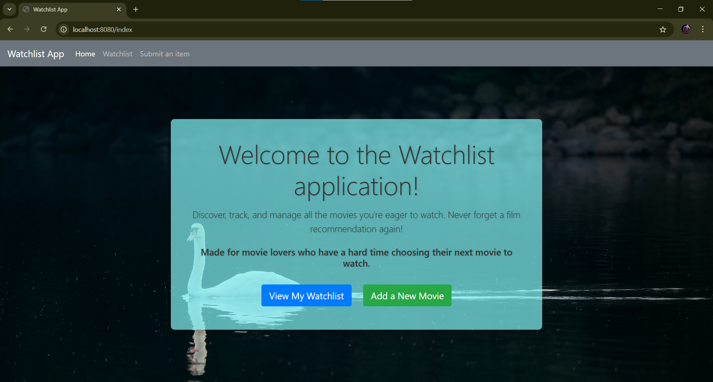
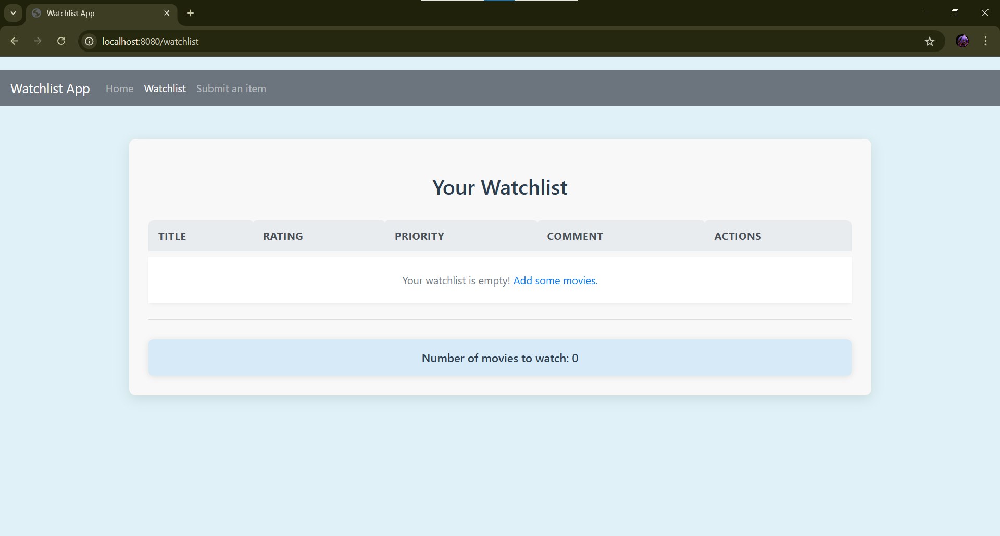
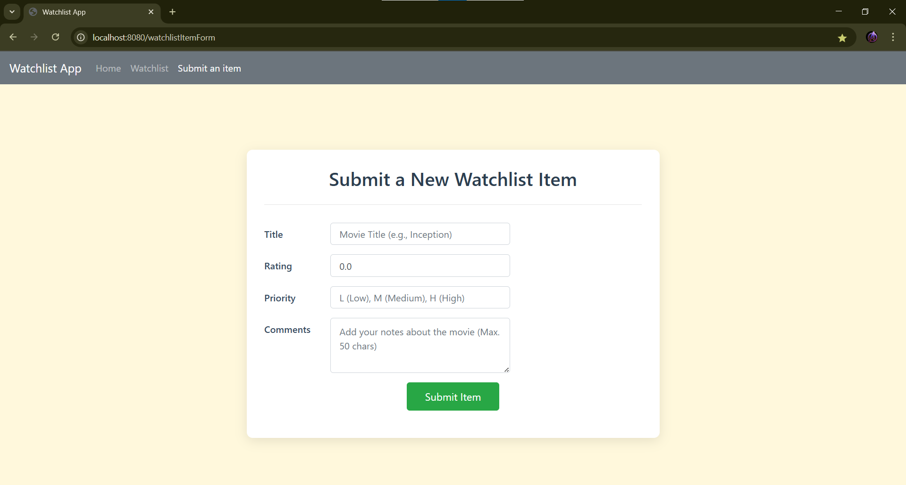

# 🎬 Watchlist App

---

## ✨ Overview

Welcome to the Watchlist App! This is a **comprehensive web application** built with Spring Boot, designed for movie lovers to effortlessly manage their personal movie watchlist. It goes beyond simple tracking, offering **robust data persistence** and **rich movie details** fetched from external APIs.

---

## 🌟 Features

* **Watchlist Management (CRUD Operations):**
    * ➕ **Add New Items:** Easily submit new movies to your watchlist.
    * 👀 **View Watchlist:** See a comprehensive list of all your saved movies.
    * ✏️ **Edit Watchlist Items:** Modify details of existing movies on your list.
    * 🗑️ **Delete Watchlist Items:** Remove movies you've already watched or no longer wish to track.
* **💾 Data Persistence:** Watchlist items are stored persistently in a database.
* **🌐 External API Integration:** Automatically fetches movie details like IMDb rating from the OMDB API to enrich your watchlist entries.
* **🖥️ Simple UI:** Built with HTML and Bootstrap for a clean and responsive user experience.
* **🚀 Robust Spring Boot Backend:** Efficiently handles all application logic, data interactions, and API calls.

---

## 🛠️ Technologies Used

* **Backend:**
    * Java 21
    * Spring Boot (v3.2.x)
    * Maven (for dependency management and build automation)
    * Spring Data JPA (for seamless database interaction)
    * Database used: **H2 Database**
* **Frontend:**
    * HTML
    * CSS (with custom styles and Bootstrap 4)
    * JavaScript (for Bootstrap's interactive components)
* **API Integration:**
    * API used: **OMDB API**

---

## 🗄️ Database

The application uses **H2 Database** to store watchlist items.

* **Why H2 (in-memory/file-based):** No external setup is typically required for development.

---

## 🔗 API Integration

Movie details are fetched from the **OMDB API** when adding a new watchlist item. An API key is required for this service.

📸 Screenshots
Here are some glimpses of the Watchlist App in action:

Home Page


Watchlist Page


Submit Item Form


🤝 Contributing
Feel free to fork the repository, make improvements, and submit pull requests. Any contributions are welcome!

📞 Contact
For any questions or suggestions, feel free to reach out.```properties
api.omdb.key=YOUR_ACTUAL_API_KEY
